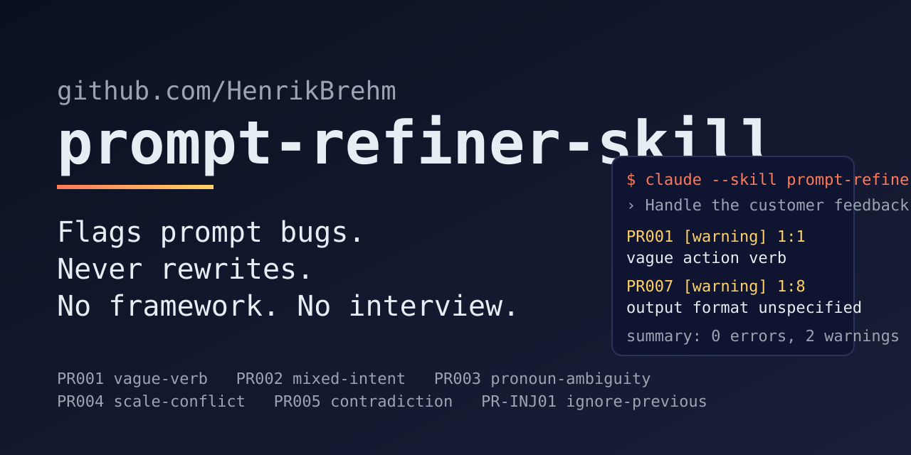

# prompt-refiner-skill

> A hybrid prompt linter — deterministic Node detector for the regex-able rules, model for the semantic ones. **Lint, don't rewrite.** No framework imposition. No interview flow. No language switching.

[](#how-the-engine-works)
[](#what-it-does-and-doesnt)
[](references/lint-rules.md)
[](scripts/run-tests.sh)
[](LICENSE)
[](CHANGELOG.md)
[](https://claude.com/claude-code)
[](https://github.com/HenrikBrehm/prompt-refiner-skill/actions/workflows/validate.yml)

---

## Contents

- [What it does (and doesn't)](#what-it-does-and-doesnt)
- [How the engine works](#how-the-engine-works)
- [Install](#install)
- [Usage](#usage)
- [Example](#example)
- [When NOT to use this skill](#when-not-to-use-this-skill)
- [How it compares to framework-based prompt tools](#how-it-compares-to-framework-based-prompt-tools)
- [CI integration](#ci-integration)
- [Cost & footprint](#cost--footprint)
- [Star history](#star-history)
- [Contributing](#contributing)
- [License & changelog](#license--changelog)

---

## What it does (and doesn't)

This skill **flags** prompt-engineering bugs against a stable, citeable rule catalog ([`references/lint-rules.md`](references/lint-rules.md)). It does **not** rewrite your prompt, does **not** ask clarifying questions, and does **not** impose a framework. You stay in control of the words; the skill points at the bugs.

Output is Markdown by default. Append `--json` (or ask for "JSON output") to get a report that validates against [`schemas/report.schema.json`](schemas/report.schema.json). Every finding is tagged with the engine that produced it.

The catalog ships 20 rules across three families:

- **Clarity & specificity** — `PR001` vague verb, `PR002` mixed intent, `PR003` ambiguous pronoun, `PR004` scale conflict, `PR005` contradictory constraints, `PR006` unbounded numeric, `PR007` implicit format, `PR008` placeholder leakage, `PR009` conflicting persona, `PR010` untestable success criterion.
- **Output hygiene & ergonomics** — `PR011` stale relative date, `PR012` politeness padding, `PR013` missing input delimiter, `PR014` reasoning-then-answer without delimiter, `PR015` unscaled rating, `PR016` open-ended creative length, `PR017` negation-only prompt.
- **Prompt injection / role confusion** — `PR-INJ01` "ignore previous" pattern, `PR-INJ02` post-input role switch, `PR-INJ03` unbounded tool authority.

## How the engine works

The skill is a **hybrid linter**, not a pure LLM rubric:

| Pass | Implementation | Rules covered | Reproducible? |
|---|---|---|---|
| **Pure deterministic** | [`scripts/lint.js`](scripts/lint.js) — zero-dep Node | `PR001`, `PR004`, `PR006`, `PR007`, `PR008`, `PR011`, `PR012`, `PR013`, `PR014`, `PR015`, `PR016`, `PR017`, `PR-INJ01`, `PR-INJ02`, `PR-INJ03` (15 of 20) | Yes — same input → same findings |
| **Hybrid** | Deterministic basic case in `scripts/lint.js` + semantic case in the model layer | `PR002`, `PR005`, `PR010` (3 of 20) | Basic case: yes. Semantic case: run-to-run drift. |
| **Pure model** | The LLM at skill activation time | `PR003` (antecedent resolution), `PR009` (persona / domain comparison) (2 of 20) | No — semantic analysis, run-to-run drift |

**18 of 20 rules** have deterministic detection (15 pure + 3 hybrid basic case). Run-to-run drift on the model layer is bounded to the 2 pure-model rules and the semantic surplus of the 3 hybrid rules.

Each finding is tagged with the engine that produced it (`_(deterministic)_` or `_(model)_`) so you can tell which line numbers to trust as stable across re-runs. The deterministic pass is independently runnable in CI without an LLM — see the [CI integration](#ci-integration) section.

## Install

### Option 1 — As a Claude Code plugin (recommended)

```bash
/plugin marketplace add HenrikBrehm/prompt-refiner-skill
/plugin install prompt-refiner@prompt-refiner-marketplace
```

### Option 2 — Manual copy (per project)

```bash
git clone https://github.com/HenrikBrehm/prompt-refiner-skill.git /tmp/prompt-refiner-skill
mkdir -p .claude/skills
cp -r /tmp/prompt-refiner-skill/skills/prompt-refiner .claude/skills/
```

The copied `skills/prompt-refiner/` directory is self-contained: it includes `SKILL.md`, the deterministic detector, the rule catalog, JSON schema, and CI recipes.

### Option 3 — Manual copy (user-level, all projects)

```bash
git clone https://github.com/HenrikBrehm/prompt-refiner-skill.git /tmp/prompt-refiner-skill
mkdir -p ~/.claude/skills
cp -r /tmp/prompt-refiner-skill/skills/prompt-refiner ~/.claude/skills/
```

## Usage

Invoke the skill with any of these phrasings — auto-routing picks it up via the trigger keywords in `SKILL.md`:

- *"Lint this prompt: \<your prompt\>"*
- *"Review my prompt for bugs: \<your prompt\>"*
- *"Audit prompt: \<your prompt\>"*
- Append `--json` for machine-readable output: *"lint --json: \<your prompt\>"*

The skill reads your prompt, applies the [rule catalog](references/lint-rules.md), and emits a Markdown report (or JSON, with `--json`) — one finding per rule that fired, with line:col citations, quoted evidence, and engine tags.

## Example

**Prompt:**

> Handle the customer feedback we got last week and write a tweet about it.

**Skill output:**

```markdown
# Prompt-refiner report

`PR001` [warning] 1:1 - `Handle` - vague action verb; name the transformation (e.g. classify, summarize). _(deterministic)_
`PR002` [error] 1:1 - `Handle ... and write a tweet ...` - two distinct intents in one instruction; split into separate steps. _(deterministic)_
`PR003` [warning] 1:60 - `it` - ambiguous antecedent (feedback or tweet?). _(model)_

**summary:** 1 error, 2 warnings, 0 info
```

The skill quotes literal evidence, cites the rule by ID, and stops. It does not propose a rewrite — that decision stays with you.

## When NOT to use this skill

- **You're writing a brand-new prompt from scratch.** Reach for a framework-based skill instead — for example [`prompt-architect`](https://github.com/ckelsoe/prompt-architect) (27 frameworks: CO-STAR, RISEN, RTF, RACE, …). It's the right shape for "I have an idea, help me prompt it well."
- **You want the AI to rewrite the prompt for you.** This skill flags; it does not author. Copy the rule rationale and edit by hand, or use a framework-based refiner for a rewrite.
- **You want the AI to interview you.** This skill is silent until it has a prompt to lint.

## How it compares to framework-based prompt tools

| | `prompt-refiner` (this skill) | Framework refiners (e.g. [`prompt-architect`](https://github.com/ckelsoe/prompt-architect), CO-STAR / RISEN / RTF builders) |
|---|---|---|
| **Best for** | Auditing a prompt you already wrote | Authoring a new prompt from scratch |
| **Output** | Lint report (rule citations + evidence) | A rewritten prompt, often 5–10× longer |
| **Frameworks (CO-STAR / RISEN / RTF / RACE)** | Never imposed — explicitly forbidden | Core feature |
| **Language handling** | Preserves original (DE → DE, JP → JP, mixed → mixed) | Often switches to English |
| **Clarifying questions** | Almost never | Often (interview-style) |
| **Output shape** | Markdown lint report or JSON (`--json`) | Variable, framework-shaped |
| **Behavior on a clean prompt** | Reports zero findings | Still imposes structure |

These tools complement each other: use `prompt-architect` to **write** a prompt, `prompt-refiner` to **audit** it before you ship.

## CI integration

The deterministic detector runs without an LLM, so you can wire it directly into git hooks and CI:

```bash
# Block commits with errors
node scripts/lint.js --fail-on=error path/to/prompt.md

# JSON output for downstream tools
node scripts/lint.js --format=json path/to/prompt.md

# Lock current findings, fail only on new ones
node scripts/lint.js --write-baseline=.prompt-refiner-baseline.json path/to/prompt.md
node scripts/lint.js --baseline=.prompt-refiner-baseline.json --fail-on=warning path/to/prompt.md
```

Suppress findings inline:
- `<!-- prompt-refiner-disable PR001 -->` — file-wide.
- `<!-- prompt-refiner-disable-next-line PR001 -->` — only the following line.
- `<!-- prompt-refiner-disable-line PR001 -->` — only the line it appears on.

Drop-in recipes:
- [`recipes/pre-commit.md`](recipes/pre-commit.md) — block commits with `error`-severity findings.
- [`recipes/github-action.md`](recipes/github-action.md) — comment the report on every PR that touches `*.prompt.md`.

## Cost & footprint

The skill loads the lint catalog plus frontmatter on activation (≈ a few KB of Markdown). The deterministic detector ([`scripts/lint.js`](scripts/lint.js)) is a single zero-dependency Node file using only the Node stdlib. It calls no external APIs and ships no binaries. The conformance suite ([`scripts/run-tests.sh`](scripts/run-tests.sh)) runs all 25 corpus cases in under a second; see [`scripts/bench.sh`](scripts/bench.sh) to reproduce.

## Star history

[](https://star-history.com/#HenrikBrehm/prompt-refiner-skill&Date)

If this skill saves you from prompt-bloat, a star is the cheapest way to help others find it.

## Contributing

PRs welcome — see [CONTRIBUTING.md](CONTRIBUTING.md). The bar is high: each change should make the skill *more reliable* or *more discoverable* without bloating it. Structural validation lives in [`scripts/validate-skill.sh`](scripts/validate-skill.sh) and runs on every push and PR via GitHub Actions; conformance lives in [`scripts/run-tests.sh`](scripts/run-tests.sh) and [`tests/corpus/`](tests/corpus/).

## License & changelog

- License: [MIT](LICENSE) © 2026 Henrik Brehm
- Release notes: [CHANGELOG.md](CHANGELOG.md)

---


